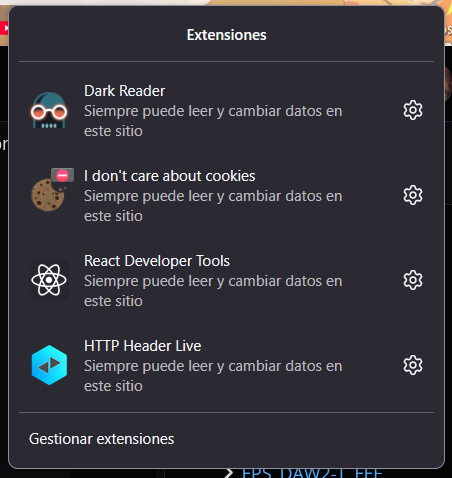
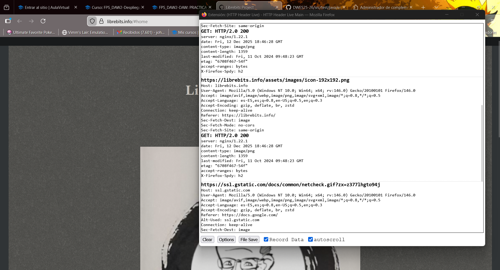
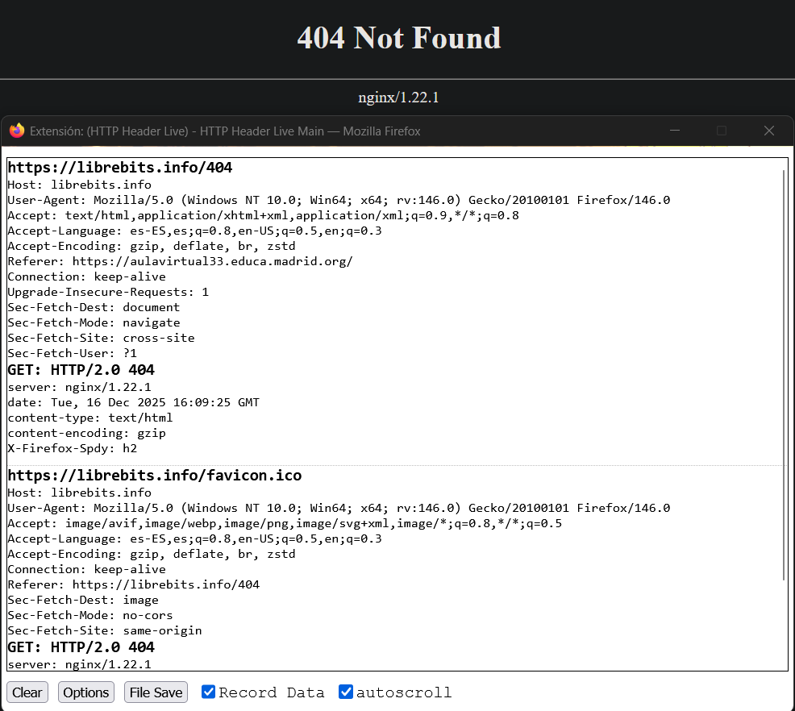
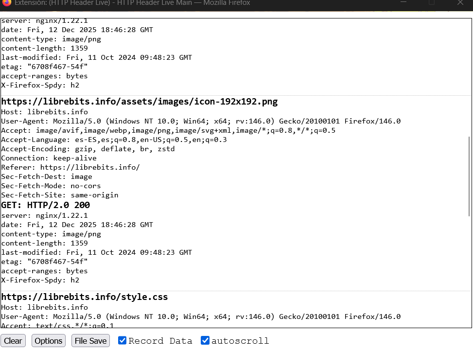
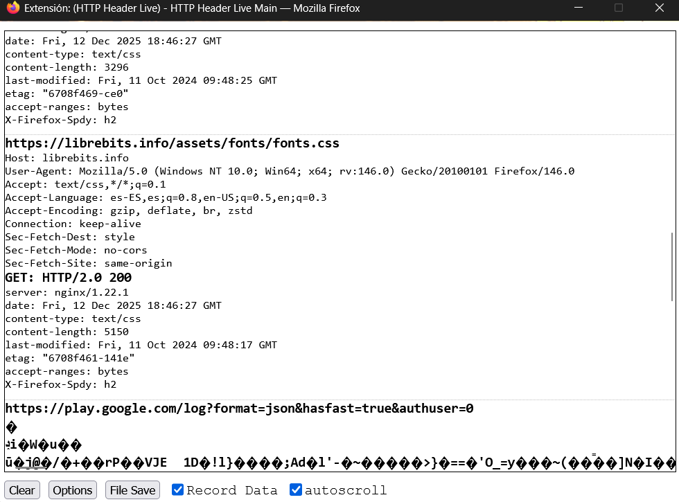

# PRACTICA HTTP - Rastreando el protocolo de la Web

## Parte 1: Instalación y configuración

Vamos a las extensoines de mozilla y descargamos HTTP Header Live



## Parte 2: Captura de petición HTTP

1. Abrimos HTTP Header Live.
2. Activamos el capturador de tráfico http si no está activo.
3. Navegamos a https://librebits.info



- ### Host
  Indica el nombre del dominio al cual se dirige la solicitud, para que el servido sepa a donde quiere acceder el usuario.
- ### User-Agent:
  Identifica desde que navegador y su versión, está accediendo a esta página web, además desde que sistema operativo se está accediendo.
- ### Acept:
  Indica que contenidos va ser capaz de procesar el navegador, en este caso prefiere archivos AVIF o WebP
- ### Acept-Language:
  Indica el idioma preferido por el usuario, en este caso es el español(es-ES), seguido por cualquier otro tipo de español y después el inglés de EE.UU
- ### Accept-Encoding:

  Informa al servidor de como va a manejar el navegador los tipos de compresión. Permite enviar archivos gzip o br

## Parte 3: Captura de respuesta HTTP

Indica que la solicitud fue exitosa. Significa "OK".

- ### Server:
  Identifica el software del servidor web que respondió a la solicitud.
- ### Date:
  Es la fecha y la hora en el que el servidor genero la respuesta
- ### Content-type:
  El tipo de medio (MIME type) del contenido que se envía. En este caso, el servidor está confirmando que el archivo es una imagen en formato PNG.
- ### Content-length:

  El tamaño del cuerpo de la respuesta (el tamaño del archivo PNG) en bytes.

- ### Código de estado: 200:

  

- ### Código de estado: 400:
  

## Análisis Comparativo de Respuestas HTTP

La comparación se realiza entre la petición a la URL raíz (A: https://librebits.info) que resulta en un código de éxito, y la petición a la URL inexistente (B: https://librebits.info/404) que resulta en un error.

## Código de estado (A),"Por ejemplo, 200 OK.

Indica que la petición ha tenido éxito y el recurso solicitado se ha devuelto en la respuesta."

## Código de estado (B),"Por ejemplo, 404 Not Found.

Indica que el servidor no ha podido encontrar el recurso solicitado. En este caso, la URL librebits.info/404 no existe."

## Elemento URL A (librebits.info) URL B (librebits.info/404)

    Conclusión / Significado de la Diferencia. Código de Estado	200 OK	404 Not Found	Diferencia Fundamental: El código 200 indica que el recurso solicitado fue encontrado y devuelto con éxito. El código 404 indica claramente que el servidor no pudo encontrar el recurso solicitado en esa ruta.

## Content-Type

```
Típicamente text/html (para la página principal).	Típicamente text/html (para la página de error 404), o a veces solo text/plain.	Similitud/Diferencia: Ambos pueden devolver text/html, ya que muchos servidores utilizan una página HTML personalizada para mostrar el error 404 al usuario.`
```

## Content-Length

```
Presente y muestra el tamaño completo de la página web.	Generalmente más pequeño o puede estar ausente si la respuesta es corta.	Diferencia: El valor es diferente. Para el código 200 (A), es la longitud de la página principal; para el 404 (B), es la longitud de la página de error.
```

## Otras Cabeceras

```
Podrían incluir cabeceras de caching específicas o Set-Cookie si es la primera visita.	Podrían incluir cabeceras que evitan el caching, indicando al navegador que no guarde en caché la página de error. Diferencia: Las cabeceras como Cache-Control pueden variar para optimizar el rendimiento y evitar que se guarde un error.
```

## DNS Lookup de librebits.info


He realizado una consulta DNS (DNS lookup) para el dominio librebits.info utilizando una extensión de navegador o el servicio online https://ns-lookup.io.

- Registros A / AAAA: Muestran las direcciones IP (IPv4 y/o IPv6) del servidor. Esto es lo que permite al navegador saber a qué máquina conectarse.

- Registros NS (Name Server): Indican los servidores DNS responsables de la gestión del dominio.

- Registro MX (Mail Exchange): (Si están presentes) Especifican los servidores de correo electrónico para el dominio.

- Registro SOA (Start of Authority): Contiene información administrativa sobre la zona, incluyendo el servidor primario y el correo del administrador.

## Parte 4: Análisis Comparativo de Recursos

La comparación se centra en cómo el servidor trata la entrega de diferentes tipos de archivos necesarios para renderizar una página web (una imagen vs. un archivo de estilos o script).

## Imagen



## Css



## Tipo de Recurso Ejemplo de Petición Ejemplo de Content-Type Significado

### Imagen GET /imagen.jpg image/jpeg o image/png

El servidor informa al navegador que el contenido del cuerpo de la respuesta es un archivo de imagen. El navegador sabe que debe decodificarlo y renderizarlo como un elemento visual en la interfaz.

### CSS/JavaScript GET /estilos.css o GET /script.js text/css o application/javascript

El servidor informa al navegador que el contenido es código. El navegador debe interpretar y ejecutar/aplicar este código (aplicar estilos a los elementos HTML o ejecutar funciones/lógica).
